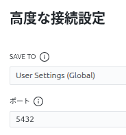
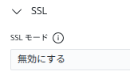

---
tags:
  - DB
---

バージョン確認

```terminal
$ psql -V
psql (PostgreSQL) 18.3 (Ubuntu 18.3-1.pgdg24.04+1)
```

CLIログイン

```terminal
$ psql -h db -U postgres -d study
Password for user postgres:
study=#
```






ユーザー表示

```psql
# \du
                             List of roles
 Role name |                         Attributes
-----------+------------------------------------------------------------
 postgres  | Superuser, Create role, Create DB, Replication, Bypass RLS

study=# select USENAME from pg_user;
 usename
----------
 postgres
(1 row)
```

データベース一覧表示

```psql
=# \l
                                                    List of databases
   Name    |  Owner   | Encoding | Locale Provider |  Collate   |   Ctype    | Locale | ICU Rules |   Access privileges
-----------+----------+----------+-----------------+------------+------------+--------+-----------+-----------------------
 postgres  | postgres | UTF8     | libc            | en_US.utf8 | en_US.utf8 |        |           |
 study     | postgres | UTF8     | libc            | en_US.utf8 | en_US.utf8 |        |           |
 template0 | postgres | UTF8     | libc            | en_US.utf8 | en_US.utf8 |        |           | =c/postgres          +
           |          |          |                 |            |            |        |           | postgres=CTc/postgres
 template1 | postgres | UTF8     | libc            | en_US.utf8 | en_US.utf8 |        |           | =c/postgres          +
           |          |          |                 |            |            |        |           | postgres=CTc/postgres
(4 rows)
```

新しいデータベースを作成し、確認

```psql
=# create database sample;
=# \l
                                                   List of databases
   Name    |  Owner   | Encoding | Locale Provider |  Collate   |   Ctype    | Locale | ICU Rules |   Access privileges
-----------+----------+----------+-----------------+------------+------------+--------+-----------+-----------------------
 postgres  | postgres | UTF8     | libc            | en_US.utf8 | en_US.utf8 |        |           |
 sample    | postgres | UTF8     | libc            | en_US.utf8 | en_US.utf8 |        |           |
 study     | postgres | UTF8     | libc            | en_US.utf8 | en_US.utf8 |        |           |
 template0 | postgres | UTF8     | libc            | en_US.utf8 | en_US.utf8 |        |           | =c/postgres          +
           |          |          |                 |            |            |        |           | postgres=CTc/postgres
 template1 | postgres | UTF8     | libc            | en_US.utf8 | en_US.utf8 |        |           | =c/postgres          +
           |          |          |                 |            |            |        |           | postgres=CTc/postgres
(5 rows)
```

テーブルを作成

```psql
=# create table staff (id integer, name character varying(10));
CREATE TABLE
```

テーブル一覧を表示

```psql
-- 標準的なテーブルを表示
=# \dt
          List of tables
 Schema | Name  | Type  |  Owner
--------+-------+-------+----------
 public | staff | table | postgres
(1 row)

- テーブルサイズやコメントを含んで詳しく表示
=# \dt+
                                     List of tables
 Schema | Name  | Type  |  Owner   | Persistence | Access method |  Size   | Description
--------+-------+-------+----------+-------------+---------------+---------+-------------
 public | staff | table | postgres | permanent   | heap          | 0 bytes |
(1 row)
```

データを追加

```psql
=# INSERT INTO staff (id, name) VALUES
study-# (1, '佐藤 健'),
(2, '鈴木 一郎'),
(3, '高橋 結衣'),
(4, '田中 太郎'),
(5, '伊藤 翼'),
(6, '渡辺 直美'),
(7, '岡田 准一'),
(8, '小林 麻央'),
(9, '加藤 浩次'),
(10, '木村 拓哉');
INSERT 0 10

- 確認
=# \dt+
                                       List of tables
 Schema | Name  | Type  |  Owner   | Persistence | Access method |    Size    | Description
--------+-------+-------+----------+-------------+---------------+------------+-------------
 public | staff | table | postgres | permanent   | heap          | 8192 bytes |
```

問い合わせ

```psql
=# SELECT * FROM staff;
 id |   name
----+-----------
  1 | 佐藤 健
  2 | 鈴木 一郎
  3 | 高橋 結衣
  4 | 田中 太郎
  5 | 伊藤 翼
  6 | 渡辺 直美
  7 | 岡田 准一
  8 | 小林 麻央
  9 | 加藤 浩次
 10 | 木村 拓哉
(10 rows)

=# SELECT id,  name FROM staff LIMIT 5;
 id |   name
----+-----------
  1 | 佐藤 健
  2 | 鈴木 一郎
  3 | 高橋 結衣
  4 | 田中 太郎
  5 | 伊藤 翼
(5 rows)

=# SELECT name FROM staff WHERE id BETWEEN 3 AND 6;
   name
-----------
 高橋 結衣
 田中 太郎
 伊藤 翼
 渡辺 直美
(4 rows)
```

CSVエクスポート

```psql
=# \copy staff TO '/workspace/export/staff_data.csv' WITH CSV HEADER;
COPY 10
```

エクスポート結果を確認

```terminal
$ cat export/staff_data.csv
id,name
1,佐藤 健
2,鈴木 一郎
3,高橋 結衣
4,田中 太郎
5,伊藤 翼
6,渡辺 直美
7,岡田 准一
8,小林 麻央
9,加藤 浩次
10,木村 拓哉
```

レコード削除

```psql
=# DELETE FROM staff WHERE id >= 7;
DELETE 4

-- 確認
=# SELECT * FROM staff;
 id |   name
----+-----------
  1 | 佐藤 健
  2 | 鈴木 一郎
  3 | 高橋 結衣
  4 | 田中 太郎
  5 | 伊藤 翼
  6 | 渡辺 直美
(6 rows)
```

全レコード削除し、リストア

```psql
=# DELETE FROM staff;
DELETE 6

-- 確認
=# SELECT * FROM staff;
 id | name
----+------
(0 rows)
```

CSVインポート

```psql
-- レコードリストア
=# \copy staff FROM './export/staff_data.csv' WITH CSV HEADER;
COPY 10

-- 確認
=# SELECT * FROM staff;
 id |   name
----+-----------
  1 | 佐藤 健
  2 | 鈴木 一郎
  3 | 高橋 結衣
  4 | 田中 太郎
  5 | 伊藤 翼
  6 | 渡辺 直美
  7 | 岡田 准一
  8 | 小林 麻央
  9 | 加藤 浩次
 10 | 木村 拓哉
(10 rows)
```

単一データベースのダンプ(バックアップ)

```terminal
$ pg_dump -h db -U postgres -d study -F c -f ./export/dump_db.dump
Password:
```

## コマンド

```psql
=# \l -- データベース一覧表示
=# \dt+ -- 詳細なテーブル一覧表示
=# CREATE DATABASE DATABASE_NAME;  -- 新しいデータベース作成
=# DROP DATABASE DATABASE_NAME;  -- データベース削除
=# SELECT current_database();  -- 現在のデータベース名表示
=# CREATE TABLE TABLE_NAME (COLUMN_NAME DATA_TYPE);  -- テーブル作成
=# DROP TABLE TABLE_NAME;  -- テーブル削除
```

## 課題

- UPDATE文を発行する
- UPSERTオプション
  - レコードが存在しない場合は挿入し、存在する場合は更新する

```
INSERT INTO users (id, name)
VALUES (1, '佐藤 健四郎')
ON CONFLICT (id)
DO UPDATE SET
  name = EXCLUDED.name;

INSERT INTO users (id, name)
VALUES (11, '中島 葵')
ON CONFLICT (id)
DO UPDATE SET
  name = EXCLUDED.name;
```

- テーブルを削除し、 **dump** よりリストアを試みたが操作がわからない。
- ディレクトリ `sql` を作成し、SQLスクリプトを作成利用する

```terminal
# コマンドラインから直接実行
$ psql -U ユーザ名 -d データベース名 -f ファイル名.sql
```

- `pg_restore` のテスト

```terminal
## 既存のデータをクリーン（削除）してからリストアする
$ pg_restore -U ユーザ名 -h ホスト名 -d データベース名 --clean --no-acl -v ファイル名.dump
```
