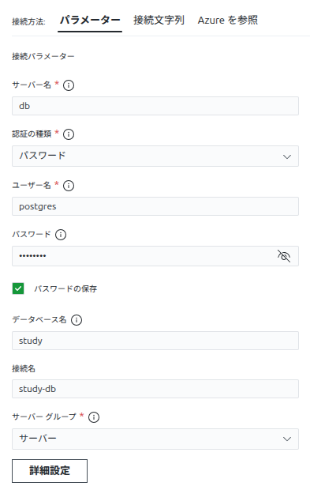

---
tags:
  - DB
---

バージョン確認

```terminal
$ psql -V
psql (PostgreSQL) 18.3 (Ubuntu 18.3-1.pgdg24.04+1)
```

## ログイン

### CLIログイン

```terminal
$ psql -h db -U postgres -d study
Password for user postgres:
study=#
```

| 短縮オプション | フルオプション | 意味           | 指定値   |
| :------------- | :------------- | :------------- | :------- |
| -h             | --host         | ホスト名       | db       |
| -U             | --username     | 接続ユーザー名 | postgres |
| -d             | --dbname       | データベース名 | study    |

### 拡張機能の設定

- パラメータ
  

- ポート
  

- SSL
  

## psqlのプロンプト一覧

| プロンプト | 状態の意味                         | ユーザーがすべきこと                             |
| :--------- | :--------------------------------- | :----------------------------------------------- |
| study=#    | コマンド受付中（正常）             | 新しいSQLや「\」コマンドを入力する               |
| study-#    | SQLの入力途中（未完了）            | SQLの末尾に「;」を付けてEnterを押す              |
| study'#    | シングルクォーテーションの閉じ忘れ | 「'」を入力して文字列を閉じ「;」を付けて実行する |
| study"#    | ダブルクォーテーションの閉じ忘れ   | 「"」を入力して識別子を閉じ「;」を付けて実行する |
| study$#    | ドル記号（$$）の閉じ忘れ           | 「$$」を入力して囲みを閉じる                     |
| study\*#   | ブロックコメントの閉じ忘れ         | 「\*/」を入力してコメントアウトを終了させる      |

## psqlコマンド

ユーザー表示

```psql
# \du
                             List of roles
 Role name |                         Attributes
-----------+------------------------------------------------------------
 postgres  | Superuser, Create role, Create DB, Replication, Bypass RLS

study=# select USENAME from pg_user;
 usename
----------
 postgres
(1 row)
```

データベース一覧表示

```psql
=# \l
                                                    List of databases
   Name    |  Owner   | Encoding | Locale Provider |  Collate   |   Ctype    | Locale | ICU Rules |   Access privileges
-----------+----------+----------+-----------------+------------+------------+--------+-----------+-----------------------
 postgres  | postgres | UTF8     | libc            | en_US.utf8 | en_US.utf8 |        |           |
 study     | postgres | UTF8     | libc            | en_US.utf8 | en_US.utf8 |        |           |
 template0 | postgres | UTF8     | libc            | en_US.utf8 | en_US.utf8 |        |           | =c/postgres          +
           |          |          |                 |            |            |        |           | postgres=CTc/postgres
 template1 | postgres | UTF8     | libc            | en_US.utf8 | en_US.utf8 |        |           | =c/postgres          +
           |          |          |                 |            |            |        |           | postgres=CTc/postgres
(4 rows)
```

新しいデータベースを作成し、確認

```psql
=# create database sample;
=# \l
                                                   List of databases
   Name    |  Owner   | Encoding | Locale Provider |  Collate   |   Ctype    | Locale | ICU Rules |   Access privileges
-----------+----------+----------+-----------------+------------+------------+--------+-----------+-----------------------
 postgres  | postgres | UTF8     | libc            | en_US.utf8 | en_US.utf8 |        |           |
 sample    | postgres | UTF8     | libc            | en_US.utf8 | en_US.utf8 |        |           |
 study     | postgres | UTF8     | libc            | en_US.utf8 | en_US.utf8 |        |           |
 template0 | postgres | UTF8     | libc            | en_US.utf8 | en_US.utf8 |        |           | =c/postgres          +
           |          |          |                 |            |            |        |           | postgres=CTc/postgres
 template1 | postgres | UTF8     | libc            | en_US.utf8 | en_US.utf8 |        |           | =c/postgres          +
           |          |          |                 |            |            |        |           | postgres=CTc/postgres
(5 rows)
```

テーブルを作成

```psql
=# create table staff (id integer, name character varying(10));
CREATE TABLE
```

テーブル一覧を表示

```psql
-- 標準的なテーブルを表示
=# \dt
          List of tables
 Schema | Name  | Type  |  Owner
--------+-------+-------+----------
 public | staff | table | postgres
(1 row)

- テーブルサイズやコメントを含んで詳しく表示
=# \dt+
                                     List of tables
 Schema | Name  | Type  |  Owner   | Persistence | Access method |  Size   | Description
--------+-------+-------+----------+-------------+---------------+---------+-------------
 public | staff | table | postgres | permanent   | heap          | 0 bytes |
(1 row)
```

データを追加

```psql
=# INSERT INTO staff (id, name) VALUES
study-# (1, '佐藤 健'),
(2, '鈴木 一郎'),
(3, '高橋 結衣'),
(4, '田中 太郎'),
(5, '伊藤 翼'),
(6, '渡辺 直美'),
(7, '岡田 准一'),
(8, '小林 麻央'),
(9, '加藤 浩次'),
(10, '木村 拓哉');
INSERT 0 10

- 確認
=# \dt+
                                       List of tables
 Schema | Name  | Type  |  Owner   | Persistence | Access method |    Size    | Description
--------+-------+-------+----------+-------------+---------------+------------+-------------
 public | staff | table | postgres | permanent   | heap          | 8192 bytes |
```

問い合わせ

```psql
=# SELECT * FROM staff;
 id |   name
----+-----------
  1 | 佐藤 健
  2 | 鈴木 一郎
  3 | 高橋 結衣
  4 | 田中 太郎
  5 | 伊藤 翼
  6 | 渡辺 直美
  7 | 岡田 准一
  8 | 小林 麻央
  9 | 加藤 浩次
 10 | 木村 拓哉
(10 rows)

=# SELECT id,  name FROM staff LIMIT 5;
 id |   name
----+-----------
  1 | 佐藤 健
  2 | 鈴木 一郎
  3 | 高橋 結衣
  4 | 田中 太郎
  5 | 伊藤 翼
(5 rows)

=# SELECT name FROM staff WHERE id BETWEEN 3 AND 6;
   name
-----------
 高橋 結衣
 田中 太郎
 伊藤 翼
 渡辺 直美
(4 rows)
```

CSVエクスポート

```psql
=# \copy staff TO '/workspace/export/staff_data.csv' WITH CSV HEADER;
COPY 10
```

エクスポート結果を確認

```terminal
$ cat export/staff_data.csv
id,name
1,佐藤 健
2,鈴木 一郎
3,高橋 結衣
4,田中 太郎
5,伊藤 翼
6,渡辺 直美
7,岡田 准一
8,小林 麻央
9,加藤 浩次
10,木村 拓哉
```

レコード削除

```psql
=# DELETE FROM staff WHERE id >= 7;
DELETE 4

-- 確認
=# SELECT * FROM staff;
 id |   name
----+-----------
  1 | 佐藤 健
  2 | 鈴木 一郎
  3 | 高橋 結衣
  4 | 田中 太郎
  5 | 伊藤 翼
  6 | 渡辺 直美
(6 rows)
```

全レコード削除し、リストア

```psql
=# DELETE FROM staff;
DELETE 6

-- 確認
=# SELECT * FROM staff;
 id | name
----+------
(0 rows)
```

CSVインポート

```psql
-- レコードリストア
=# \copy staff FROM './export/staff_data.csv' WITH CSV HEADER;
COPY 10

-- 確認
=# SELECT * FROM staff;
 id |   name
----+-----------
  1 | 佐藤 健
  2 | 鈴木 一郎
  3 | 高橋 結衣
  4 | 田中 太郎
  5 | 伊藤 翼
  6 | 渡辺 直美
  7 | 岡田 准一
  8 | 小林 麻央
  9 | 加藤 浩次
 10 | 木村 拓哉
(10 rows)
```

単一データベースのダンプ(バックアップ)

```terminal
$ pg_dump -h db -U postgres -d study -F c -f ./export/dump_db.dump
Password:
```

## コマンド

```psql
=# \l -- データベース一覧表示
=# \dt+ -- 詳細なテーブル一覧表示
=# CREATE DATABASE DATABASE_NAME;  -- 新しいデータベース作成
=# DROP DATABASE DATABASE_NAME;  -- データベース削除
=# SELECT current_database();  -- 現在のデータベース名表示
=# CREATE TABLE TABLE_NAME (COLUMN_NAME DATA_TYPE);  -- テーブル作成
=# DROP TABLE TABLE_NAME;  -- テーブル削除
```

## PL/pgSQL

**PL/pgSQL**
: SQLを拡張した手続き型プログラミング言語。

### 特徴

- 手続き処理を行える
- マルチプラットフォーム
- 高いパフォーマンス
- `SELECT` から呼び出し可能であること
- 関数本文は `$$` クォーテーションで囲むこと

ブロック構造

```
DECLARE
  宣言部
BEGIN
  実行部
EXCEPTION
  例外処理部
END;
```

CREATE FUNCTION
: 関数を作成定義する

REPLACE FUNCTION
: 既存の関数の戻り値を変更する

DROP FUNCTION
: `CREATE OR REPLACE FUNCTION` で作成した関数の戻り値を変更する

**PL/pgSQL** が利用できるか確認

```psql
y=# SELECT lanname FROM pg_language WHERE lanname='plpgsql';
 lanname
---------
 plpgsql
```

コード例を示す

```psql
study=# DO LANGUAGE plpgsql $$
study$# BEGIN
study$# RAISE NOTICE 'Hello PL/pgSQL';
study$# END;
study$# $$;
NOTICE:  Hello PL/pgSQL
DO
```

### CREATE FUNCTION

構文

```psql
CREATE OR REPLACE FUNCTION
  name ( [ argname ] argtype  [, ... ] ] )
  RETURN rettype as $$
  関数本文
$$
LANGUAGE lang_name
```

```psql
-- 関数本文は `$$` クォーテーションで囲むこと
-- hello 関数を定義
study=# CREATE FUNCTION hello()
study-# RETURNS text
study-# AS $$
study$# BEGIN
study$# RETURN 'Hello Postgres PL/pgSQL';
study$# END;
study$# $$
study-# LANGUAGE plpgsql;
CREATE FUNCTION

-- 定義した hello 関数を呼び出す
study=# SELECT hello();
          hello
-------------------------
 Hello Postgres PL/pgSQL
```

既存の関数一覧を表示

```psql
study=# \df
                       List of functions
 Schema | Name  | Result data type | Argument data types | Type
--------+-------+------------------+---------------------+------
 public | hello | text             |                     | func
```

### TDD

[pgTAP](https://pgtap.org/) を用いる。

```psql
-- pgTAP拡張機能をインストール
=# CREATE EXTENSION IF NOT EXISTS pgtap;
```

失敗するテストを書く

```psql
-- test_increment.sql
BEGIN;

-- 2つのテストを実行することを宣言
SELECT plan(2);

-- テストケース1：正の数 5 を渡したら 6 が返るべき
SELECT is(
    increment_if_positive(5),
    6,
    '正の数の場合は+1されて返ること'
);

-- テストケース2：負の数 -3 を渡したら -3 が返るべき
SELECT is(
    increment_if_positive(-3),
    -3,
    '負の数の場合はそのまま返ること'
);

-- テスト結果の集計
SELECT * FROM finish();
ROLLBACK;
```

テストを実行

```terminal
$ psql -d your_database -f test_increment.sql
# 結果は Red
# ERROR: function increment_if_positive(integer) does not exist
```

最小の実装を行う

```psql
-- test_increment.sql の BEGIN; 直後に以下を挿入
CREATE OR REPLACE FUNCTION increment_if_positive(val INT)
RETURNS INT AS $$
BEGIN
    IF val > 0 THEN
        RETURN val + 1;
    ELSE
        RETURN val;
    END IF;
END;
$$ LANGUAGE plpgsql;
```

テスト再実行

```terminal
$ psql -d your_database -f test_increment.sql

ok 1 - 正の数の場合は+1されて返ること
ok 2 - 負の数の場合はそのまま返ること
# Green
```

リファクタリング

```psql
-- リファクタリング後の関数定義
CREATE OR REPLACE FUNCTION increment_if_positive(val INT)
RETURNS INT AS $$
BEGIN
    RETURN CASE WHEN val > 0 THEN val + 1 ELSE val END;
END;
$$ LANGUAGE plpgsql;
```

最終確認

```terminal
$ psql -d your_database -f test_increment.sql
# Green
```

### 簡易デバッグ

RAISE NOTE
: 標準出力へ出力する

`RAISE NOTE` をデバッグプリントの変わりに使う。

```psql
study=# DO $$
study$# DECLARE
study$#   v_user_name TEXT := '青木';
study$#   v_user_id INT := 999;
study$# BEGIN
study$#   -- メッセージを出力
study$#   RAISE NOTICE '処理を開始...';
study$#
study$#   -- 変数の値を埋め込んで出力
study$#   RAISE NOTICE 'ユーザー名: %, 名前: %', v_user_id, v_user_name;
study$# END $$;
NOTICE:  処理を開始...
NOTICE:  ユーザー名: 999, 名前: 青木
DO
```

`DO` が出力さえる理由は仕様だからです。 `DO $$` で開始された手続き型言語がエラーなく終了したので、出力された。

```psql
study=# CREATE OR REPLACE FUNCTION func2_4()
study-# RETURNS void AS $$
study$# BEGIN
study$#   RAISE NOTICE '吾輩の名前は%である。', 'ポチ';
study$#   RETURN;
study$# END;
study$# $$ LANGUAGE plpgsql;
CREATE FUNCTION
study=# SELECT func2_4();
NOTICE:  吾輩の名前はポチである。
 func2_4
---------

-- 関数の大文字小文字の区別はない
study=# SELECT FUNC2_4();
NOTICE:  吾輩の名前はポチである。
 func2_4
---------
```

`\i` : ファイルに保存したsqlを登録する

```psql
study-# \i sql/func2_4.sql
CREATE FUNCTION -- 作成に成功するとメッセージが表示される
```

登録した関数を利用する

```psql
study=# SELECT func2_4();
NOTICE:  吾輩の名前はポチである。
 func2_4
---------
```

### 変数の宣言と代入

```psql
CREATE OR REPLACE FUNCTION func3_1()
RETURNS INTEGER AS $$
  DECLARE
    var integer; -- 宣言部: 変数varをinteger型で宣言
    BEGIN
    var := 10; -- 実行部: 10を代入
    RETURN var;
  END;
$$ LANGUAGE plpgsql;
```

`NOT NULL` の利用

```psql
CREATE OR REPLACE FUNCTION func3_2()
RETURNS INTEGER AS $$
  DECLARE
    -- NOT NULL の場合は宣言と同時に値を代入する
    var INTEGER NOT NULL DEFAULT 2;
    var2 INTEGER NOT NULL := 8;
  BEGIN
    RETURN var + var2;
  END;
$$ LANGUAGE plpgsql;
```

引数を受け取る

```psql
CREATE OR REPLACE FUNCTION func3_3(var INTEGER)
RETURNS INTEGER AS $$
  BEGIN
    RETURN var;
  END;
$$ LANGUAGE plpgsql;

study=# \i ./sql/func3_3.sql
study=# SELECT func3_3(9);
 func3_3
---------
       9
```

```psql
CREATE OR REPLACE FUNCTION func3_4(var INTEGER)
RETURNS INTEGER AS $$
  DECLARE
    var ALIAS FOR $1; -- 1番めの引数を var として別名利用
  BEGIN
    RETURN var;
  END;
$$ LANGUAGE plpgsql;

-- 型違反の引数を渡す
study=# SELECT func3_4(10.25);
ERROR:  function func3_4(numeric) does not exist
LINE 1: SELECT func3_4(10.25);
               ^
HINT:  No function matches the given name and argument types. You might need to add explicit type casts.
```

### データ型

- スカラ型: PostgresSQLで用意されている型(文字列、数値、日付など)
- レコード型: レコードを保持する型
- カーソル型: カーソルを用いて1レコード毎に読み取る

`%TYPE`
: 指定したテーブルの列のデータ型を用いる。列のデータ型が変更されても変数の型が自動で従う。

```psql
-- テーブル定義
CREATE TABLE TYPE_SAMPLE(
    user_id: NUMERIC;
    user_name: TEXT,
    PRIMARY KEY (user_id)
);

-- テーブルからデータを取得して変数に代入
CREATE OR REPLACE FUNCTION func3_6()
RETURNS TEXT AS $$
  DECLARE
   -- TYPE_SAMPLEのuser_name列と同じデータ型に従う
    name TYPE_SAMPLE.user_name%TYPE;
  BEGIN
    name := 'sample text';
    RETURN name;
  END;
$$ LANGUAGE plpgsql;
```

`ROWTYPE`
: テーブルから最初の1レコードを保持する

```sql
-- 引数をidとする
-- テーブルを検索し、user_nameを取得する
CREATE OR REPLACE FUNCTION func3_7(NUMERIC)
RETURNS TEXT AS $$
    DECLARE
        id ALIAS FOR $1;
        -- id=$1 該当行の最初の1レコードを変数 `sample_row` に代入
        sample_row TYPE_SAMPLE%ROWTYPE;
    BEGIN
        SELECT * INTO sample_row FROM TYPE_SAMPLE WHERE user_id = id;
        RETURN sample_row.user_name;
    END;
$$ LANGUAGE plpgsql;
```

### 定数

`CONSTANT` で定数を定義する。

```psql
CREATE OR REPLACE FUNCTION func3_8(INTEGER)
RETURNS INTEGER AS $$
    DECLARE
        num ALIAS FOR $1;
        const_num CONSTANT INTEGER := 5; -- 定数を定義
        rtn INTEGER;
    BEGIN
        rtn := num * const_num;
        RETURN rtn;
    END;
$$ LANGUAGE plpgsql;

-- 関数登録
study=# \i ./sql/func3_8.sql
CREATE FUNCTION
-- 関数実行
study=# SELECT func3_8(10);
 func3_8
---------
      50
```

`func3_8` の現代的な記述に書き換える。 パラメータに名前を付け(名前付き引数)、 `num ALIAS FOR $1;` を置き換える。

```psql
-- 名前付き引数として定義
CREATE OR REPLACE FUNCTION func3_8(num INTEGER) -- 引数に直接名前をつける
RETURNS INTEGER AS $$
    DECLARE
        const_num CONSTANT INTEGER := 5;
        rtn INTEGER;
    BEGIN
        rtn := num * const_num;
        RETURN rtn;
    END;
$$ LANGUAGE plpgsql;
```

## 制御構造

### 条件分岐

**IF** 文

構文

```
IF <条件式> THEN
  <処理>;
ELSE
  <処理>;
END IF
```

```
IF <条件式> THEN
  <処理>;
ELSIF <条件式> THEN
  <処理>;
ELSE
  <処理>;
END IF
```

```psql
CREATE OR REPLACE FUNCTION func4_1(var INTEGER)
RETURNS TEXT AS $$
    BEGIN
        IF var > 10 THEN
            RETURN '指定された値は10以上です。';
        ELSIF var = 10 THEN
            RETURN '指定された値は10ぴったりです。';
        ELSE
            RETURN '指定された値は10未満です。';
        END IF;
    END;
$$ LANGUAGE plpgsql;
```

**CASE** 文

単純な`CASE` 文: 評価式が1度だけ評価され、`WHEN` 句内のそれぞれの `expression` と比較される。

```
CASE <評価式>
  WHEN expression [, expression [...]] THEN
    <処理>
  [ WHEN expression [, expression [...]] THEN
      <処理>;
      ...]
  [ ELSE
    <処理>; ]
END CASE;
```

```psql
CREATE OR REPLACE FUNCTION func4_2(var INTEGER)
RETURNS TEXT AS $$
    BEGIN
        CASE var
            WHEN 10,11,12,13,14,15,16,17,18,19 THEN
                RETURN '指定された値は10番代です。';
            WHEN 20,21,22,23,24,25,26,27,26,29 THEN
                RETURN '指定された値は20番代です。';
            ELSE
                RETURN '指定された値は10番代でも20番代ででもありません。';
        END CASE;
    END;
$$ LANGUAGE plpgsql;
```

検索付きCASE 文

上から順に条件式が評価され、最初の条件が真となった `WHEN` 句内の処理を実行する。

```psql
CREATE OR REPLACE FUNCTION func4_3(var INTEGER)
RETURNS TEXT AS $$
    BEGIN
        CASE
            WHEN var > 10 THEN
                RETURN '指定された値は10以上です。';
            WHEN var = 10 THEN
                RETURN '指定された値は10ぴったりです。';
            ELSE
                RETURN '指定された値は10未満です。';
        END CASE;
    END;
$$ LANGUAGE plpgsql;
***
```

### 反復処理

**LOOP** 文

`IF` 文の条件が満たされるまで `LOOP` の処理を繰り返す。反復処理は可能な限り、可読性が高い `IF` を用いる。

構文

```
LOOP
  <処理>
  IF <条件式> THEN
    EXIT;
  END IF;
END LOOP
```

```psql
CREATE OR REPLACE FUNCTION func4_4(var INTEGER)
RETURNS INTEGER AS $$
    DECLARE
        num INTEGER := 0;
        total INTEGER := 0;
    BEGIN
        LOOP
            num = num + 1;
            total = total + num;
            IF num = var THEN
                EXIT;
            END IF;
        END LOOP;
        RETURN total;
    END;
$$ LANGUAGE plpgsql;
```

**WHILE LOOP** 文

`LOOP` の先頭で条件を判断し、条件を満たす限り `LOOP` 文の処理を繰り返す。

```psql
CREATE OR REPLACE FUNCTION func4_5(var INTEGER)
RETURNS INTEGER AS $$
    DECLARE
        num INTEGER := 0;
        total INTEGER := 0;
    BEGIN
        -- num が var 未満の場合LOOP処理を行う
        WHILE num < var LOOP
            num = num + 1;
            total = total + 1;
        END LOOP;
        RETURN total;
    END;
$$ LANGUAGE plpgsql;

study=# \i sql/func4_5.sql
CREATE FUNCTION
study=# SELECT func4_5(10);
 func4_5
---------
      10
(1 row)

study=# SELECT func4_5(-10);
 func4_5
---------
       0
```

**FOR** 文

整数 **FOR** ループ: ループカウンタは `DECLARE` 部で宣言せずに使える。

```psql
CREATE OR REPLACE FUNCTION func4_6(var INTEGER)
RETURNS INTEGER AS $$
    DECLARE
        total INTEGER := 0;
    BEGIN
        FOR i IN 1 .. var LOOP
            total = total + i;
        END LOOP;
        RETURN total;
    END;
$$ LANGUAGE plpgsql;

study=# \i sql/func4_6.sql
CREATE FUNCTION

study=# SELECT func4_6(7);
 func4_6
---------
      28
```

### 順序制御

**CONTINUE** 文: 特定の条件の成立時に処理を行うない。

```psql
CREATE OR REPLACE FUNCTION func4_8(var INTEGER)
RETURNS VOID AS $$
    BEGIN
        FOR i IN 1 .. var LOOP
            -- i が偶数の時に処理をスキップ
            CONTINUE WHEN mod(i, 2) = 0;
            RAISE NOTICE '%', i;
        END LOOP;
        RETURN;
    END;
$$ LANGUAGE plpgsql;

-- スキップされなかった i値が出力される
study=# SELECT func4_8(10);
NOTICE:  1
NOTICE:  3
NOTICE:  5
NOTICE:  7
NOTICE:  9
```

ラベルを使ってブロック構造に名前付けを行う。

```psql
CREATE OR REPLACE FUNCTION func4_10(var INTEGER)
RETURNS VOID AS $$
    BEGIN
        <<outer_for>> -- ラベル
        FOR i IN 1 ..  var LOOP
            <<inner_for>> -- ラベル
            FOR j IN 1 .. var LOOP
                CONTINUE inner_for WHEN mod(j, 2) = 0;
                RAISE NOTICE 'outer_for >> %, inner_for => %', i, j;
            END LOOP;
        END LOOP;
        RETURN;
    END;
$$ LANGUAGE plpgsql;

study=# SELECT func4_10(3);
NOTICE:  outer_for >> 1, inner_for => 1
NOTICE:  outer_for >> 1, inner_for => 3
NOTICE:  outer_for >> 2, inner_for => 1
NOTICE:  outer_for >> 2, inner_for => 3
NOTICE:  outer_for >> 3, inner_for => 1
NOTICE:  outer_for >> 3, inner_for => 3
```

```psql
CREATE OR REPLACE FUNCTION func4_11(var INTEGER)
RETURNS VOID AS $$
    BEGIN
        <<outer_for>> -- ラベル
        FOR i IN 1 ..  var LOOP
            <<inner_for>> -- ラベル
            FOR j IN 1 .. var LOOP
                CONTINUE outer_for WHEN mod(j, 2) = 0;
                RAISE NOTICE 'outer_for >> %, inner_for => %', i, j;
            END LOOP;
        END LOOP;
        RETURN;
    END;
$$ LANGUAGE plpgsql;

study=# \i sql/func4_11.sql
CREATE FUNCTION
study=# SELECT func4_11(3);
NOTICE:  outer_for >> 1, inner_for => 1
NOTICE:  outer_for >> 2, inner_for => 1
NOTICE:  outer_for >> 3, inner_for => 1
```

## テーブルから取得する

### SELECT INTO

- **PL/pgSQL** でのみ用いる
- `SELECT` した結果を変数に代入する
- 結果が1レコードのみ `SELECT` 文で用いる

テーブル定義

```sql
-- テーブルの作成
-- sql/create_jinko.sql
CREATE TABLE
    JINKO (
        code CHAR(2) PRIMARY KEY,
        name TEXT NOT NULL,
        jinko NUMERIC
    );
```

レコード挿入

```sql
-- データの挿入
-- sql/insert_jinko.sql
INSERT INTO
    JINKO (code, name, jinko)
VALUES
    ('13', '東京都', 13000000),
    ('14', '神奈川県', 9000000),
    ('27', '大阪府', 8000000),
    ('23', '愛知県', 7500000),
    ('11', '埼玉県', 7300000);
```

```psql
-- 都道府県の人口を取得する
CREATE OR REPLACE FUNCTION func5_1(var_code CHAR)
RETURNS NUMERIC AS $$
    DECLARE
        var_jinko JINKO.jinko%TYPE;
    BEGIN
        SELECT jinko INTO var_jinko FROM JINKO WHERE code = var_code;
        RETURN var_jinko;
    END;
$$ LANGUAGE plpgsql;

study=# \i sql/func5_1.sql
study=# SELECT func5_1('11');
 func5_1
---------
 7300000
```

安全性を高めたコード

```psql
-- 都道府県の人口を取得する
CREATE OR REPLACE FUNCTION func5_1(var_code JINKO.code%TYPE) -- 型をテーブルに合わせる
RETURNS NUMERIC AS $$
    DECLARE
        var_jinko JINKO.jinko%TYPE;
    BEGIN
        SELECT jinko INTO var_jinko FROM JINKO WHERE code = var_code;

        -- データが見つからなかった（NULLだった）場合の処理
        IF var_jinko IS NULL THEN
            RETURN 0;
        END IF;

        RETURN var_jinko;
    END;
$$ LANGUAGE plpgsql;
```

### カーソル

```psql
CREATE OR REPLACE FUNCTION func5_2()
RETURNS VOID AS $$
    DECLARE
        var_code CHAR(2);
        var_name TEXT;
        -- FOR の後がカーソルが保持するレコード定義
        jinko_cursor CURSOR FOR SELECT code, name FROM JINKO;
    BEGIN
        -- カーソルを有効にするには OPEN が必要
        OPEN jinko_cursor;
        -- 複数レコードを取得するため LOOP が必須
        LOOP
            -- FETCH でデータ取得
            -- 取得する変数の数と型がカーソル定義と合致していること
            FETCH jinko_cursor INTO var_code, var_name;
            -- 取得するレコードが存在しなくなると FOUND が FALSE として返される
            -- これを条件に関数を終了する
            IF NOT FOUND THEN
                EXIT;
            END IF;
            RAISE NOTICE '都道府県コード=%, 都道府県=%', var_code, var_name;
        END LOOP;
        -- OPEN したカーソルを CLOSE する
        CLOSE jinko_cursor;
        RETURN;
    END;
$$ LANGUAGE plpgsql;

study=# \i sql/func5_2.sql
CREATE FUNCTION
study=# SELECT func5_2();
NOTICE:  都道府県コード=13, 都道府県=東京都
NOTICE:  都道府県コード=14, 都道府県=神奈川県
NOTICE:  都道府県コード=27, 都道府県=大阪府
NOTICE:  都道府県コード=23, 都道府県=愛知県
NOTICE:  都道府県コード=11, 都道府県=埼玉県
```

### 条件付きカーソル

関数のコメント(ドキュメント)は関数定義の後に書くのが習わしです。

```psql
CREATE OR REPLACE FUNCTION func5_3(number_of_people NUMERIC)
RETURNS VOID AS $$
    DECLARE
        var_code CHAR(2);
        var_name TEXT;
        jinko_cursor CURSOR (min_pop NUMERIC) FOR SELECT code, name
            FROM JINKO WHERE jinko >= min_pop;
    BEGIN
        OPEN jinko_cursor (min_pop := number_of_people);
        LOOP
            FETCH jinko_cursor INTO var_code, var_name;
            IF NOT FOUND THEN
                EXIT;
            END IF;
            RAISE NOTICE ' 都道府県コード =%, 都道府県名 =%', var_code, var_name;
        END LOOP;
        CLOSE jinko_cursor;
        RETURN;
    END;
$$ LANGUAGE plpgsql;

-- データベースに関数の説明を登録
COMMENT ON FUNCTION func5_3(NUMERIC) IS
'指定された人口以上の都道府県コードと都道府県名をコンソールに出力します。
引数: number_of_people - 抽出基準となる人口（しきい値）';

-- 日本の人口を超えた数を指定
study=# SELECT func5_3(300000000);
 func5_3 -- 何も返されない
-- 大阪府より一人少ない人口を指定
study=# SELECT func5_3(7999999);
NOTICE:   都道府県コード =13, 都道府県名 =東京都
NOTICE:   都道府県コード =14, 都道府県名 =神奈川県
NOTICE:   都道府県コード =27, 都道府県名 =大阪府
 func5_3
---------
---------
```

### レコードを組み合わせる

レコード型は値が代入されるまで内部の構造が決まらない。カーソルと共に用いるとコードの保守性が向上し、便利である。

```psql
CREATE OR REPLACE FUNCTION func5_4()
RETURNS SETOF TEXT AS $$
    DECLARE
        var_rec RECORD;
        jinko_cursor CURSOR FOR SELECT code, name FROM JINKO;
    BEGIN
        OPEN jinko_cursor;
        LOOP
            FETCH jinko_cursor INTO var_rec; -- ここで変数 var_rec の具体的な内容が決まる
            IF NOT FOUND THEN
                EXIT;
            END IF;
            RAISE NOTICE ' 都道府県コード=%, 都道府県名=%', var_rec.code, var_rec.name;
        END LOOP;
        CLOSE jinko_cursor;
        RETURN;
    END;
$$ LANGUAGE plpgsql;
```

### WHERE CURRENT OF

カーソルを使って取り出した行に更新や削除を行える。

```psql
-- code=11のnameは千葉県が正しい
study=# SELECT * FROM jinko;
 code |   name   |  jinko
------+----------+----------
 13   | 東京都   | 13000000
 14   | 神奈川県 |  9000000
 27   | 大阪府   |  8000000
 23   | 愛知県   |  7500000
 11   | 千葉県   |  7300000
```

`WHERE CURRENT OF` を使って修正する。

```psql
CREATE OR REPLACE FUNCTION func5_5()
RETURNS void AS $$
    DECLARE
        var_rec RECORD;
        -- FOR UPDATE としてSELECT時に行に排他ロックを行う
        jinko_cursor CURSOR FOR SELECT * FROM JINKO FOR UPDATE;
    BEGIN
        OPEN jinko_cursor;
        LOOP
            FETCH jinko_cursor INTO var_rec;
            IF NOT FOUND THEN
                EXIT;
            END IF;

            --
            IF var_rec.code = '11' AND NOT var_rec.name = '埼玉県' THEN
                UPDATE JINKO SET name = '埼玉県'
                    WHERE CURRENT OF jinko_cursor;
                RAISE NOTICE '誤ったデータを埼玉県に修正しました。';
            END IF;
        END LOOP;
        CLOSE jinko_cursor;
        RETURN;
    END;
$$ LANGUAGE plpgsql;

study=# \i sql/func5_5.sql
CREATE FUNCTION
study=# SELECT func5_5();
NOTICE:  誤ったデータを埼玉県に修正しました。
```

```psql
-- 確認
study=# SELECT * FROM JINKO;
 code |   name   |  jinko
------+----------+----------
 13   | 東京都   | 13000000
 14   | 神奈川県 |  9000000
 27   | 大阪府   |  8000000
 23   | 愛知県   |  7500000
 11   | 埼玉県   |  7300000
```

### FOR ループ

`FOR` ループを用いることで

- `FOR` の開始時にカーソルを自動でオープンする
- 'END LOOP` 時にカーソルを自動でクローズする
- 結果を全件取得すれば `FOR` 文を抜けるので `EXIT` 条件判断が不要
- `RECORD` 型の変数宣言も不要

```psql
CREATE OR REPLACE FUNCTION func5_6()
RETURNS void AS $$
    DECLARE
        jinko_cursor CURSOR FOR SELECT code, name FROM JINKO;
    BEGIN
        FOR var_rec IN jinko_cursor LOOP
            RAISE NOTICE '都道府県コード =%, 都道府県名 =%', var_rec.code, var_rec.name;
        END LOOP;
        RETURN;
    END;
$$ LANGUAGE plpgsql;
```

条件付きカーソルも `FOR` 文で書き換える。

```psql
CREATE OR REPLACE FUNCTION func5_7(p_key NUMERIC)
RETURNS void AS $$
    DECLARE
        jinko_cursor CURSOR (key NUMERIC) FOR SELECT code, name
            FROM JINKO WHERE jinko >= key;
    BEGIN
        FOR var_rec IN jinko_cursor (p_key) LOOP
            RAISE NOTICE '都道府県コード =%, 都道府県名 =%', var_rec.code, var_rec.name;
        END LOOP;
        RETURN;
    END;
$$ LANGUAGE plpgsql;

COMMENT ON FUNCTION func5_7(NUMERIC) IS
'指定された人口以上の都道府県コードと名前をコンソールに出力する関数。
@param p_key 抽出条件とする最小の人口数（この値以上のレコードを対象とする）';

study=# \i sql/func5_7.sql
CREATE FUNCTION
COMMENT
study=# SELECT func5_7(9000001);
NOTICE:  都道府県コード =13, 都道府県名 =東京都
```

## 例外処理

現在のテーブルを書籍に合わせ更新

```psql
study=# \d jinko
                  Table "public.jinko"
 Column |     Type     | Collation | Nullable | Default
--------+--------------+-----------+----------+---------
 code   | character(2) |           | not null |
 name   | text         |           | not null |
 jinko  | numeric      |           |          |
Indexes:
    "jinko_pkey" PRIMARY KEY, btree (code)

study=# ALTER TABLE jinko ADD COLUMN area integer;
ALTER TABLE

study=# \d jinko
                  Table "public.jinko"
 Column |     Type     | Collation | Nullable | Default
--------+--------------+-----------+----------+---------
 code   | character(2) |           | not null |
 name   | text         |           | not null |
 jinko  | numeric      |           |          |
 area   | integer      |           |          |
Indexes:
    "jinko_pkey" PRIMARY KEY, btree (code)

study=# UPDATE jinko SET area = 2191 WHERE code = '13';
UPDATE jinko SET area = 2416 WHERE code = '14';
UPDATE jinko SET area = 1905 WHERE code = '27';
UPDATE jinko SET area = 5172 WHERE code = '23';
UPDATE jinko SET area = 3798 WHERE code = '11';
UPDATE jinko SET area = 0    WHERE code = '12';

study=# SELECT * FROM jinko;
 code |   name   |  jinko   | area
------+----------+----------+------
 13   | 東京都   | 13000000 | 2191
 14   | 神奈川県 |  9000000 | 2416
 27   | 大阪府   |  8000000 | 1905
 23   | 愛知県   |  7500000 | 5172
 11   | 埼玉県   |  7300000 | 3798
 12   | 千葉県   |  6300000 |    0
```

例外が発生する関数

```psq
CREATE OR REPLACE FUNCTION func6_1()
RETURNS void AS $$
    DECLARE
        mitsudo NUMERIC;
        menseki_cursor CURSOR FOR SELECT * FROM jinko ORDER BY code;
    BEGIN
        FOR var_rec IN menseki_cursor LOOP
            mitsudo := ROUND(var_rec.jinko / var_rec.area, 2);
                RAISE NOTICE '都道府県名 =%, 人口密度 =%', var_rec.name, mitsudo;
        END LOOP;
        RETURN;
    END;
$$ LANGUAGE plpgsql;

study=# SELECT func6_1();
NOTICE:  都道府県名 =埼玉県, 人口密度 =1922.06
ERROR:  division by zero
CONTEXT:  PL/pgSQL function func6_1() line 7 at assignment
```

`code` の昇順に処理される。`code=11` の埼玉県の処理は成功する。 `code=12` の千葉県で `division by zero` 例外が発生し以降の処理はすべて行われない。

### 例外の補足

例外の補足は **EXCEPTION** から始まり **END** までで定義する。

```psql
CREATE OR REPLACE FUNCTION func6_2()
RETURNS void AS $$
    DECLARE
        mitsudo NUMERIC;
        menseki_cursor CURSOR FOR SELECT * FROM jinko ORDER BY code;
    BEGIN
        FOR var_rec IN menseki_cursor LOOP
            BEGIN -- 副ブロック: 例外が発生する可能性のある処理
                mitsudo := ROUND(var_rec.jinko / var_rec.area, 2);
                    RAISE NOTICE '都道府県名 =%, 人口密度 =%', var_rec.name, mitsudo;
            EXCEPTION
                WHEN division_by_zero THEN
                    RAISE NOTICE '[ERROR] 都道府県名: % の処理中に0除算が行われまいした。', var_rec.name;
                WHEN others THEN - あらゆる例外を補足
                    RAISE NOTICE 'その他の例外が発生しました。';
            END;
        END LOOP;
        RETURN;
    END;
$$ LANGUAGE plpgsql;

study=# \i sql/func6_2.sql
CREATE FUNCTION
study=# SELECT func6_2();
NOTICE:  都道府県名 =埼玉県, 人口密度 =1922.06
NOTICE:  [ERROR] 都道府県名: 千葉県 の処理中に0除算が行われまいした。
NOTICE:  都道府県名 =東京都, 人口密度 =5933.36
NOTICE:  都道府県名 =神奈川県, 人口密度 =3725.17
NOTICE:  都道府県名 =愛知県, 人口密度 =1450.12
NOTICE:  都道府県名 =大阪府, 人口密度 =4199.48
```

### 例外の種類

| 条件名                 | 意味                                |
| :--------------------- | :---------------------------------- |
| foreign_key_violation  | 外部キー制約違反                    |
| division_by_zero       | 0で除算された                       |
| null_value_not_allowed | NUll不許可の引数にNULLが渡された    |
| no_data_found          | FETCHしたがデータが取得できなかった |

## 例外情報の取得

詳細な情報を取得する: **SQLSTATE** , **SQLERRM**

`SQLSTATE`

- 処理結果を表す5文字のエラーコード
- `EXCEPTION` 例外処理部で直接利用する
- `DECLARE` 部で宣言されない。

```psql
CREATE OR REPLACE FUNCTION func6_3()
RETURNS void AS $$
    DECLARE
        mitsudo NUMERIC;
        menseki_cursor CURSOR FOR SELECT * FROM JINKO ORDER BY code;
    BEGIN
        FOR var_rec IN menseki_cursor LOOP
            BEGIN -- サブブロック開始
                mitsudo := ROUND(var_rec.jinko / var_rec.area, 2);
                    RAISE NOTICE '都道府県名 =%, 人口密度 =%', var_rec.name, mitsudo;
            EXCEPTION
                WHEN others THEN
                    RAISE NOTICE '[ERROR]; 都道府県の%の処理中のエラー: %', var_rec.name, SQLSTATE;
            END; -- サブブロック終了
        END LOOP;
        RETURN;
    END;
$$ LANGUAGE plpgsql;

study=# \i sql/func6_3.sql
CREATE FUNCTION
study=# SELECT func6_3();
NOTICE:  都道府県名 =埼玉県, 人口密度 =1922.06
NOTICE:  [ERROR]; 都道府県の千葉県の処理中のエラー: 22012
NOTICE:  都道府県名 =東京都, 人口密度 =5933.36
NOTICE:  都道府県名 =神奈川県, 人口密度 =3725.17
NOTICE:  都道府県名 =愛知県, 人口密度 =1450.12
NOTICE:  都道府県名 =大阪府, 人口密度 =4199.48
-- SQLSTATE(エラーコード)が22012であることがわかる
```

`SQLERRM`

- `EXCEPTION` 例外処理部で発生したエラーメッセージテキストが格納される特殊変数

```psql
CREATE OR REPLACE FUNCTION func6_4()
RETURNS void AS $$
    DECLARE
        mitsudo NUMERIC;
        menseki_cursor CURSOR FOR SELECT * FROM JINKO ORDER BY code;
    BEGIN -- メインブロック
        FOR var_rec IN menseki_cursor LOOP
            BEGIN -- サブブロック
                mitsudo := ROUND(var_rec.jinko / var_rec.area, 2);
                    RAISE NOTICE '都道府県名 =%, 人口密度 =%', var_rec.name, mitsudo;
        EXCEPTION
            WHEN others THEN
                -- SQLSTATEコードとSQLERRMメッセージを出力
                RAISE NOTICE '[ERROR]: SQLSTATE=%, エラーメッセージ=%', SQLSTATE, SQLERRM;
            END;-- サブブロック終了
        END LOOP;
        RETURN;
    END; -- メインブロック終了
$$ LANGUAGE plpgsql;

study=# \i sql/func6_4.sql
CREATE FUNCTION
study=# SELECT func6_4();
NOTICE:  都道府県名 =埼玉県, 人口密度 =1922.06
NOTICE:  [ERROR]: SQLSTATE=22012, エラーメッセージ=division by zero
NOTICE:  都道府県名 =東京都, 人口密度 =5933.36
NOTICE:  都道府県名 =神奈川県, 人口密度 =3725.17
NOTICE:  都道府県名 =愛知県, 人口密度 =1450.12
NOTICE:  都道府県名 =大阪府, 人口密度 =4199.48
```

### 独自例外

ユーザー定義例外は存在しない。  
擬似的なユーザー定義例外を定義するには、 `RAISE/SQLSTATE/SQLERRM` を利用する。

```psql
CREATE OR REPLACE FUNCTION func6_5()
RETURNS void AS $$
    DECLARE
        mitsudo NUMERIC;
        menseki_cursor CURSOR FOR SELECT * FROM JINKO ORDER BY code;
    BEGIN
        FOR var_rec IN menseki_cursor LOOP
            BEGIN -- サブブロック開始
                IF var_rec.area = 0 THEN
                    RAISE EXCEPTION SQLSTATE 'ZZZZZ' USING MESSAGE =
                        var_rec.name || 'の面積が0です。';
                END IF;
                mitsudo := ROUND(var_rec.jinko / var_rec.area, 2);
                    RAISE NOTICE '都道府県名 =%, 人口密度 =%', var_rec.name, mitsudo;
            EXCEPTION
                WHEN others THEN
                    RAISE NOTICE '[ERROR]: SQLSTATE=%, エラーメッセージ=%',
                        SQLSTATE, SQLERRM;
            END; -- サブブロック終了
        END LOOP;
        RETURN;
    END;
$$ LANGUAGE plpgsql;

study=# \i sql/func6_5.sql
CREATE FUNCTION
study=# SELECT func6_5();
NOTICE:  都道府県名 =埼玉県, 人口密度 =1922.06
NOTICE:  [ERROR]: SQLSTATE=ZZZZZ, エラーメッセージ=千葉県の面積が0です。
NOTICE:  都道府県名 =東京都, 人口密度 =5933.36
NOTICE:  都道府県名 =神奈川県, 人口密度 =3725.17
NOTICE:  都道府県名 =愛知県, 人口密度 =1450.12
NOTICE:  都道府県名 =大阪府, 人口密度 =4199.48
```

## ロールバック

| 例外処理 | ロールバック |
| :------- | :----------- |
| あり     | いいえ       |
| なし     | はい         |

`EXCEPTION` 句を使用すると処理が遅くなる。例外を起こさないコーディングを心がける。
