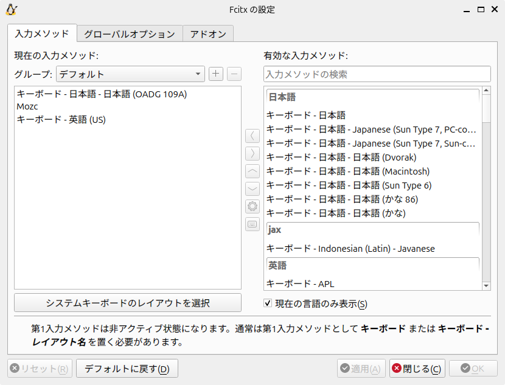
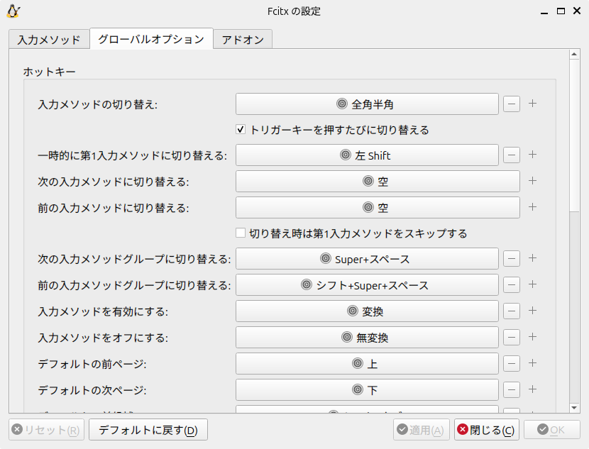
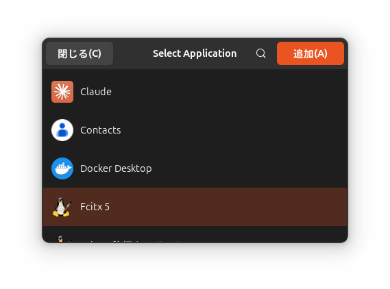
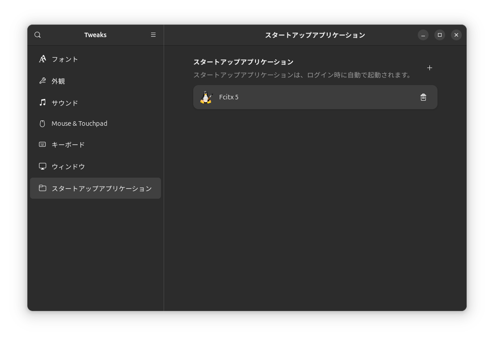

---
tags:
  - Ubuntu
---

# Fcitx5の利用

## インストール

```terminal
$ sudo apt update
$ sudo apt -y install fcitx5 fcitx5-mozc fcitx5-configtool
```

インプットメソッドを指定する。

```terminal
$ im-config -n fcitx5
```

システムで使用するインプットメソッドを指定する。

## 入力メソッドの設定

GUI設定用パネルを呼び出す。

```terminal
$ fcitx5-configtool
# 再起動
```

`@` 等の入力が正常に行えない。日本語OADG キーボードに設定する。

1. 画面左側で[日本語OADG 109A]を探す
2. 画面中央の[<]ボタンをクリックする
3. 画面中央の[^]ボタンで一番上に移動する



## グローバルオプションの設定

1. [入力メソッドの切り替え]を[全角半角]のみにする
2. [入力メソッドを有効にする]のボタンをクリックし、`変換` キーを押す
3. [入力メソッドをオフにする]のボタンをクリックし、`無変換` キーを押す
4. [適用]ボタンをクリック
   

## 快適に使うための設定

```terminal
$ sudo nano /etc/environment

# ファイル末尾に以下を記述
# Fcitx5 Japanese Input Settings
GTK_IM_MODULE=fcitx
QT_IM_MODULE=fcitx
XMODIFIERS=@im=fcitx
```

## スタートアップへ登録

```terminal
sudo apt install gnome-tweaks
gnome-tweaks
```





## 再起動

再起動する。
