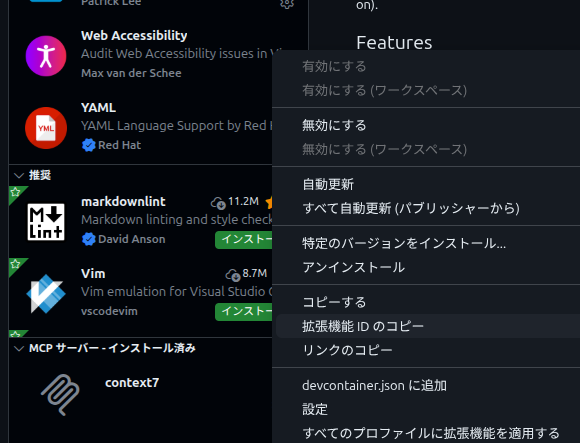
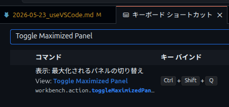
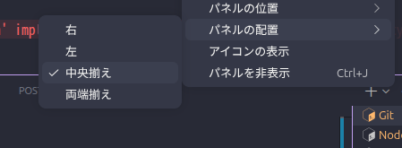

---
tags:
  - VSCode
---

# 拡張機能の削除

**拡張機能IDのコピー** をクリック



ターミナル

```terminal
$ code --uninstall-extension [Shift]+[Insert]
```

拡張機能の検索窓に `@installed` と入力し `Enter` キー

## ターミナルの最大化

`Ctrl` + `Shift` + `Q`

キーボードショートカットの確認方法

1. `Ctrl + K` ＞ `Ctrl + S` でキーボード・ショートカット設定を開く
2. 検索ボックスに `Toggle Maximized Panel` と入力
   
3. `Ctrl` + `Shift` + `Q` と設定
4. ターミナルの空きスペースを右クリック
5. パネルの配置を中央にする
   
