# Flexbox

- Flexコンテナとして扱う要素に `display: flex` を適用
- Flexアイテム: Flexコンテナが内包する要素
- 主軸: Flexアイテムを並べる方向
  - 交差軸: 主軸に対して垂直方向の軸
- 各プロパティは用語を組み合わせた名称

| 用語      | 機能               |
| :-------- | :----------------- |
| `justify` | 主軸方向を調整     |
| `align`   | 交差軸方向を調整   |
| `self`    | 単一のFlexアイテム |
| `items`   | 各行のFlexアイテム |
| `content` | Flexアイテム全体   |

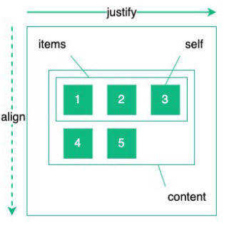

**flex-wrap**
: Flexアイテムの折返しを制御

| 値             | 機能             |
| :------------- | :--------------- |
| `nowrap`       | 折り返さない     |
| `wrap`         | 折り返す         |
| `wrap-reverse` | 逆方向に折り返す |

```css
.container {
  display: flex;
  flex-warp: nowrap;
}
```

**flex-grow**
: 親要素の余白を子要素がどれだけ伸びるかを決める比率

- 全てのFlexアイテムが `flex-grow: 0`
  - 初期値
  - 誰も余白を欲しがらない
  - 右側に余白が残る
- 一つだけ `flex-grow: 1`
  - 余ったスペースを専有
- 全て `flex-grow: 1`
  - 全て均等に余白を分け合う
  - 全ての横幅が同一
- 要素Aに `flex-grow: 1` /要素Bに `flex-grow: 2` を指定
  - 余白を1対2の比率で分け合う

```html
<!-- 左右のボタンは文字のサイズにして、真ん中の入力欄だけを限界まで広げる -->
<div style="display: flex; width: 100%;">
  <div style="flex-grow: 0;">左のボタン</div>
  <div style="flex-grow: 1; background: lightblue;">ここのみ限界まで広がる（真ん中）</div>
  <div style="flex-grow: 0;">右のボタン</div>
</div>
```

**flex-shrink**
: 親要素の幅が狭くて子要素が入りきらないとき、どれだけ縮むかを決める比率

- 全てのFlexアイテムが `flex-shrink: 1`
  - 初期値
  - 全てのアイテムが均等な比率で縮む
  - 親要素の枠内にぴったり収まる
- 一つだけ `flex-shrink: 1`
  - 本来のサイズのまま縮むことはない
- 要素Aに `flex-shrink: 1` /要素Bに `flex-shrink: 2` を指定
  - 縮んだとき要素Bは要素Aの2倍縮む

```html
<!-- アイコン/画像などが画面が狭くなった時に潰れることに対応 -->
<div style="display: flex; width: 300px; background: #eee;">
  <!-- 画像やアイコンは絶対に潰したくないので 0 を指定 -->
  <div style="flex-shrink: 0; width: 80px; background: lightcoral;">画像（絶対潰れない）</div>

  <!-- テキスト側は画面が狭くなったら縮んでもOKなので 1（自動） -->
  <div style="flex-shrink: 1; background: lightblue;">
    ここには長い文章が入ります。画面が狭くなったらこちらが縮みます。
  </div>
</div>
```

**flex-basis**
: 主軸に対するサイズを指定

Flexプロパティの一括指定
: `flex-grow` `flex-shrink` `flex-basis` を一括で指定可能

- 値が1つ: `flex-grow` の値
- 値が2つ: 1つ目 `flex-grow`
  - 1つ目がサイズ指定なら `flex-basis` の値
  - 2つ目が数値指定なら `flex-shrink` の値
- 値が3つ
  - 1つ目: `flex-grow` の値
  - 2つ目: `flex-shrink` の値
  - 3つ目: `flex-basis` の値

**justify-content**
: 主軸に対する配置

| 値           | 機能         |
| :----------- | :----------- |
| `flex-start` | 先頭側に配置 |
| `flex-end`   | 末尾側に配置 |
| `center`     | 中央に配置   |

コンテナとアイテム間の余白

| 値              | 配置       | 機能                       |
| :-------------- | :--------- | :------------------------- |
| `space-between` | 均等に配置 | 余白なし                   |
| `space-around`  | 均等に配置 | 隣接アイテム間の余白の半分 |
| `space-evenly`  | 均等に配置 | 隣接アイテム間の余白と同じ |

**align-items**
: 各行のアイテム交差軸に対する配置

| 値           | 機能                                       |
| :----------- | :----------------------------------------- |
| `flex-start` | 先頭側に配置                               |
| `flex-end`   | 末尾側に配置                               |
| `center`     | 中央に配置                                 |
| `baseline`   | 主軸に対する配置アイテムベースラインに配置 |
| `stretch`    | 各アイテムのサイズが同じように配置         |

**align-self**
: 単一のアイテムの交差軸に対する配置

| 値           | 機能                               |
| :----------- | :--------------------------------- |
| `flex-start` | 先頭側に配置                       |
| `flex-end`   | 末尾側に配置                       |
| `center`     | 中央に配置                         |
| `stretch`    | 各アイテムのサイズが同じように配置 |

# Grid

`display: grid;`

- Gridコンテナの中にGridアイテムを並べる
- Gridセル: Gridアイテムを配置できる単位
- GridアイテムはGridセルをまたいで配置可能
- Gridトラック: 各行や列に引かれる2本の線に囲まれた領域
  - 列トラックと行トラック

`grid-template-columns`
: 列トラックのサイズを適用

```css
.container {
  display: grid;
  grid-template-columns: 64px 1fr 2.5fr;
}
```

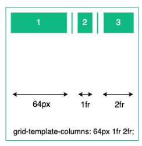

`grid-template-rows`
: 行トラックのサイズを適用

```css
.container {
  display: grid;
  grid-template-columns: 1fr 2fr 1fr;
  grid-template-rows: 1fr 2fr 1fr;
}
```

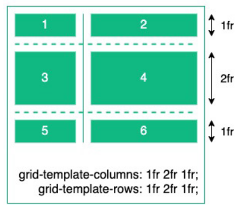

## Grid線

**Grid線**
: Gridコンテナを定義するために引かれる行と列を表す線

```css
.item {
  grid-column-start: 1;
  gird-column-end: 3;
  grid-row-start: 1;
  grid-row-end: 2;
}
```

インライン軸/ブロック軸

インライン軸
: アイテムを並べる行方向

ブロック軸
: アイテムを並べる行方向

| プロパティ名 | 機能                   |
| :----------- | :--------------------- |
| `justify`    | インライン軸方向を調整 |
| `align`      | ブロック軸方向を調整   |
| `self`       | 単一のアイテム         |
| `items`      | 各アイテム             |
| `content`    | アイテム全体           |

## インライン軸に対する配置

**justify-content**
: インライン軸に対する配置

| 値              | 機能         |
| :-------------- | :----------- |
| `start`         | 先頭側に配置 |
| `end`           | 末尾側に配置 |
| `center`        | 中央に配置   |
| `space-between` | 均等に配置   |

コンテナとアイテム間の余白

| 値              | 配置       | 機能                       |
| :-------------- | :--------- | :------------------------- |
| `space-between` | 均等に配置 | 余白なし                   |
| `space-around`  | 均等に配置 | 隣接アイテム間の余白の半分 |
| `space-evenly`  | 均等に配置 | 隣接アイテム間の余白と同じ |

**justify-self**
: 単一のアイテムのインライン軸に対する配置

| 値           | 機能                               |
| :----------- | :--------------------------------- |
| `flex-start` | 先頭側に配置                       |
| `flex-end`   | 末尾側に配置                       |
| `center`     | 中央に配置                         |
| `stretch`    | 各アイテムのサイズが同じように配置 |

## ブロック軸に対する配置

**align-content**
: ブロック軸に対する配置

| 値              | 機能         |
| :-------------- | :----------- |
| `start`         | 先頭側に配置 |
| `end`           | 末尾側に配置 |
| `center`        | 中央に配置   |
| `space-between` | 均等に配置   |

コンテナとアイテム間の余白

| 値              | 配置       | 機能                       |
| :-------------- | :--------- | :------------------------- |
| `space-between` | 均等に配置 | 余白なし                   |
| `space-around`  | 均等に配置 | 隣接アイテム間の余白の半分 |
| `space-evenly`  | 均等に配置 | 隣接アイテム間の余白と同じ |

**align-items**
: 各アイテムのブロック軸に対する配置

| 値         | 機能                                           |
| :--------- | :--------------------------------------------- |
| `start`    | 先頭側に配置                                   |
| `end`      | 末尾側に配置                                   |
| `center`   | 中央に配置                                     |
| `baseline` | 各アイテムのベースラインが同じになるように配置 |
| `stretch`  | 各アイテムのサイズが同じになるように配置       |

**align-self**
: 単一のアイテムのブロック軸に対する配置

| 値           | 機能                               |
| :----------- | :--------------------------------- |
| `flex-start` | 先頭側に配置                       |
| `flex-end`   | 末尾側に配置                       |
| `center`     | 中央に配置                         |
| `stretch`    | 各アイテムのサイズが同じように配置 |

# レイアウトを作る

## ヘッダー

- Flexコンテナー: ロゴと4つのリンクを含む
- Fleアイテム: 左にロゴを配置、4つのリンク群を右に配置

### 考え方

1. `display: flex` を使って、横並び(デフォルト配置)のレイアウトにする
2. ロゴアイコンとリンク一覧をフレックスアイテムに加える
3. `justify-content: space-between` を使って、ロゴアイコンを左に配置し、リンク一覧を右に配置する

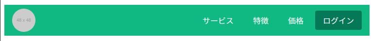

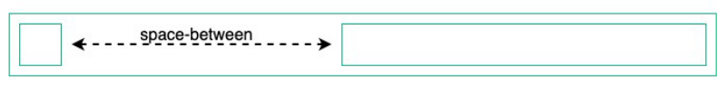

```txt
[Flexコンテナ（.header-nav）]
├─【.logo】（左端に配置）
├──────────────── 余白（自動計算された空きスペース）
└─【.links】（右端に配置）
```

```html
<!DOCTYPE html>
<html lang="ja">
  <head>
    <meta charset="UTF-8" />
    <meta
      name="viewport"
      content="width=device-width, initial-scale=1.0"
    />
    <title>レイアウト</title>
    <style>
      .header-nav {
        display: flex;
        /* 最初と最後の要素を親要素の両端に合わせる */
        justify-content: space-between;
        align-items: center;
        height: 64px;
        padding: 0 16px;
        background-color: #10b981;
      }

      .header-nav .logo {
        display: block;
        border-radius: 50%;
      }

      .header-nav .links {
        display: flex;
        gap: 8px;
      }

      /* header-navクラスの全子孫要素でlinksクラスの全子孫要素にあたるa要素 */
      .header-nav .links a {
        color: #ffffff;
        text-decoration: none;
        padding: 8px 16px;
        border-radius: 4px;
      }

      .header-nav .links a:hover {
        background-color: #947857;
      }

      .header-nav .links .button {
        background-color: #047857;
      }

      .header-nav .links button:hover {
        background-color: #064e3b;
      }
    </style>
  </head>

  <body>
    <h1>Flex boxレイアウト</h1>
    <nav class="header-nav">
      <div>
        <a href="#">
          
          <!-- <span class="sr-only">ホームへ戻る</span> -->
        </a>
      </div>
      <div class="links">
        <a href="#">サービス</a>
        <a href="#">特徴</a>
        <a href="#">価格</a>
        <a
          href="#"
          class="button"
          >ログイン</a
        >
      </div>
    </nav>
  </body>
</html>
```

## サイドナビ

- 左側にリンク一覧を配置
- 3つのリンク群は縦並び

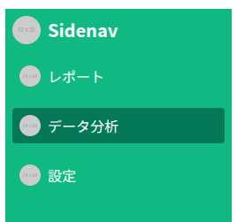

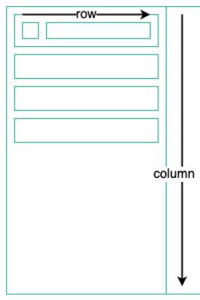

### 考えた

1. `height: 100vh` を使って、横幅を画面サイズの横幅と同一にする
2. `display: flex` を使って、横並び(デフォルト配置)のレイアウトにする
3. `flex-direction: column;` を使って、リンク一覧を上下に並べる
4. `display: flex align-items: center` を使って、アインとリンクテキストを左右並び、中央寄せする

```html
<!DOCTYPE html>
<html lang="ja">
  <head>
    <meta charset="UTF-8" />
    <meta
      name="viewport"
      content="width=device-width, initial-scale=1.0"
    />
    <title>レイアウト</title>
    <style>
      .sidenav {
        display: flex;
        flex-direction: column;
        width: 256px;
        height: 100vh;
        background-color: #10b981;
      }

      .sidenav a {
        color: #ffffff;
        text-decoration: none;
      }

      .sidenav a img {
        border-radius: 50%;
      }

      .sidenav .logo {
        display: flex;
        align-items: center;
        gap: 8px;
        padding: 8px;
        font-size: 20px;
        font-weight: bold;
      }

      .sidenav .link {
        display: flex;
        align-items: center;
        gap: 8px;
        padding: 8px;
        margin: 8px;
        border-radius: 4px;
      }

      .sidenav .link img {
        border-radius: 50%;
      }

      .sidenav .link:hover {
        background-color: #047857;
      }
    </style>
  </head>

  <body>
    <h1>Flex boxレイアウト</h1>
    <nav class="sidenav">
      <a
        class="logo"
        href="#"
      >
        
        <span>Sidenav</span>
      </a>
      <a
        class="link"
        href="#"
      >
        
        <span>レポート</span>
      </a>
      <a
        class="link"
        href="#"
      >
        
        <span>データ分析</span>
      </a>
      <a
        class="link"
        href="#"
      >
        
        <span>設定</span>
      </a>
    </nav>
  </body>
</html>
```

## ヒーロー

- タイトル、フレーズ、ボタンを中央配置/上下並び

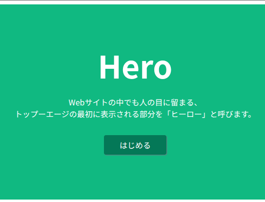

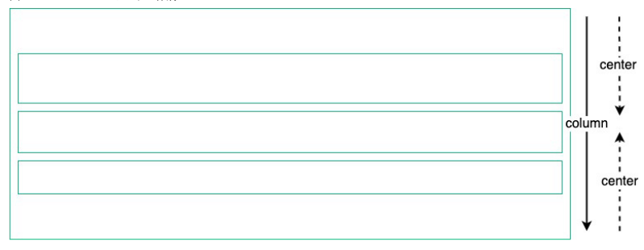

### 考え方

1. `display: flex` を使って、横並び(デフォルト配置)のレイアウトにする
2. flex-direction: column` を使って、タイトル/フレーズ/ボタンを上下3段に並べる
3. `justify-content: center` を使って、タイトル/フレーズ/ボタンを左右中央に並べる

```html
<!DOCTYPE html>
<html lang="ja">
  <head>
    <meta charset="UTF-8" />
    <meta
      name="viewport"
      content="width=device-width, initial-scale=1.0"
    />
    <title>レイアウト</title>
    <style>
      .hero {
        display: flex;
        flex-direction: column;
        justify-content: center;
        align-items: center;
        gap: 32px;
        height: 400px;
        padding: 0 64px;
        background-color: #10b981;
        color: #ffffff;
        text-align: center;
      }

      .hero .title {
        margin: 0;
        font-size: 64px;
        line-height: 1;
      }

      .hero .body {
        margin: 0;
      }

      .hero .button {
        display: inline-block;
        padding: 8px 32px;
        border-radius: 4px;
        text-decoration: none;
        color: #ffffff;
        background-color: #047857;
        box-shadow: 1px 1px 2px #6b7280;
      }

      .hero .button:hover {
        background-color: #064e3b;
      }
    </style>
  </head>

  <body>
    <div class="hero">
      <h1 class="title">Hero</h1>
      <p class="body">
        Webサイトの中でも人の目に留まる、<br />
        トップーエージの最初に表示される部分を「ヒーロー」と呼びます。
      </p>
      <!-- flexプロパティが横並びの時、縦長に引き伸ばされる -->
      <!-- これを align-items: stretch (デフォルト値) を抑止するのに divタグが必要 -->
      <div>
        <a
          href="#"
          class="button"
        >
          はじめる
        </a>
      </div>
    </div>
  </body>
</html>
```

## タイル状の配置

- タイトルと特徴一覧を左右に配置
- 特徴一覧をタイル状に配置

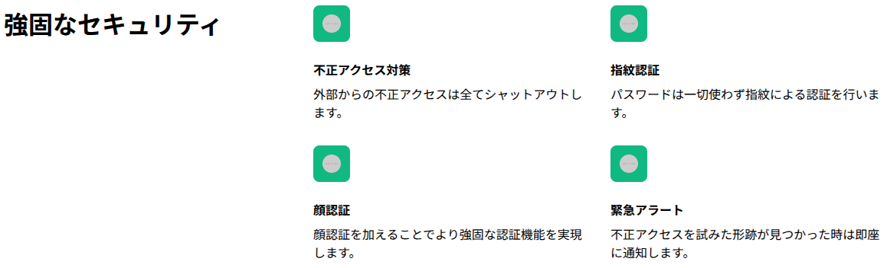

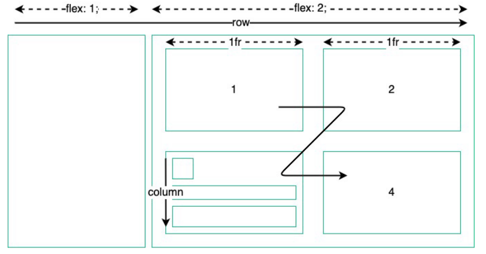

### 考え方

1. `display: flex` を使って、横並び(デフォルト配置)のレイアウトにする
2. `flex-direction: row` を明示して、タイトルと特徴を左右に配置
3. `display: grid` を使って、タイル状に配置(グリッドレイアウト)にする
4. `gird-template-columns: 1fr 1fr` を使って、タイトルと特徴の比率を2:1にする
5. `flex-direction: column` を使って、アイコンと特徴文言を上下に配置

```html
<!DOCTYPE html>
<html lang="ja">
  <head>
    <meta charset="UTF-8" />
    <meta
      name="viewport"
      content="width=device-width, initial-scale=1.0"
    />
    <title>レイアウト</title>
    <style>
      .features {
        display: flex;
        flex-direction: row;
        gap: 32px;
      }

      .features .title {
        flex: 1;
        margin: 0;
        font-size: 32px;
        font-weight: bold;
      }

      .features .body {
        flex: 2;
        display: grid;
        grid-template-columns: 1fr 1fr;
        gap: 32px;
      }

      .features .feature {
        display: flex;
        flex-direction: column;
        gap: 8px;
      }

      .features .feature .icon {
        width: 48px;
        height: 48px;
        padding: 12px;
        box-sizing: border-box;
        border-radius: 8px;
        background-color: #10b981;
      }

      .features .feature .icon img {
        border-radius: 50%;
      }

      .features .feature .name {
        margin: 16px 0 0 0;
        font-weight: bold;
      }

      .features .feature .text {
        margin: 0;
      }
    </style>
  </head>

  <body>
    <div class="features">
      <h1 class="title">強固なセキュリティ</h1>
      <div class="body">
        <div class="feature">
          <div class="icon">
            
          </div>
          <p class="name">不正アクセス対策</p>
          <p class="text">外部からの不正アクセスは全てシャットアウトします。</p>
        </div>

        <div class="feature">
          <div class="icon">
            
          </div>
          <p class="name">指紋認証</p>
          <p class="text">パスワードは一切使わず指紋による認証を行います。</p>
        </div>

        <div class="feature">
          <div class="icon">
            
          </div>
          <p class="name">顔認証</p>
          <p class="text">顔認証を加えることでより強固な認証機能を実現します。</p>
        </div>

        <div class="feature">
          <div class="icon">
            
          </div>
          <p class="name">緊急アラート</p>
          <p class="text">不正アクセスを試みた形跡が見つかった時は即座に通知します。</p>
        </div>
      </div>
    </div>
  </body>
</html>
```

## 料金プラン

- 料金プランを左右に配置
- 各プランの内容は上下に配置

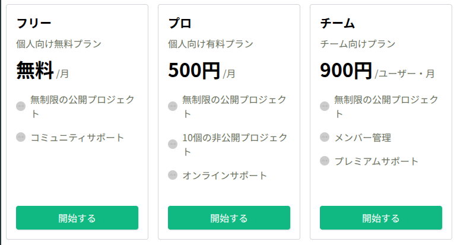

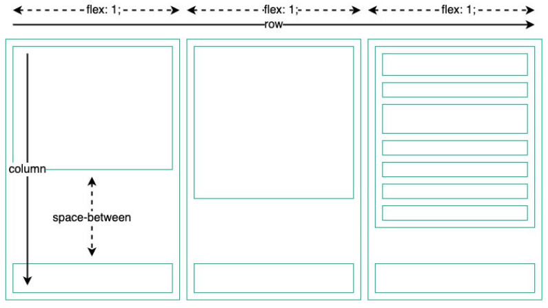

### 考え方

1. `display: flex` を使って、横並び(デフォルト配置)のレイアウトにする
2. `flex: 1` を使って、各料金プランの幅を均一にする
3. `flex-direction: column` を使って、プラン内容を上下配置にする
4. `justify-content: space-between` を使って、上下橋にぴったり合わせる

```html
<!DOCTYPE html>
<html lang="ja">
  <head>
    <meta charset="UTF-8" />
    <meta
      name="viewport"
      content="width=device-width, initial-scale=1.0"
    />
    <title>レイアウト</title>
    <style>
      .prices {
        display: flex;
        gap: 16px;
      }

      .prices .column {
        flex: 1;
        display: flex;
        flex-direction: column;
        justify-content: space-between;
        gap: 32px;
        padding: 16px;
        color: #6b7260;
        background-color: #ffffff;
        border: solid 1px #d1d5db;
        border-radius: 4px;
      }

      .prices .column h5 {
        margin: 0;
        color: #000000;
        font-size: 20px;
      }

      .prices .column p {
        margin: 8px 0;
      }

      .prices .column .amount {
        color: #000000;
        font-size: 32px;
        font-weight: bold;
      }

      .prices .column .feature {
        display: flex;
        align-items: center;
        gap: 8px;
      }

      .prices .column .feature img {
        border-radius: 50%;
      }

      .prices .column .button {
        display: block;
        padding: 8px 32px;
        border-radius: 4px;
        text-align: center;
        text-decoration: none;
        color: #ffffff;
        background-color: #10b981;
        box-shadow: 1px 1px 2px #d1d5db;
      }

      .prices .column .button:hover {
        background-color: #047857;
      }
    </style>
  </head>

  <body>
    <div class="prices">
      <div class="column">
        <div>
          <h5>フリー</h5>
          <p>個人向け無料プラン</p>
          <p>
            <span class="amount">無料</span>
            <span>/月</span>
          </p>
          <div class="feature">
            
            <p>無制限の公開プロジェクト</p>
          </div>
          <div class="feature">
            
            <p>コミュニティサポート</p>
          </div>
        </div>
        <div>
          <a
            href="#"
            class="button"
            >開始する</a
          >
        </div>
      </div>
      <!--  -->
      <div class="column">
        <div>
          <h5>プロ</h5>
          <p>個人向け有料プラン</p>
          <p>
            <span class="amount">500円</span>
            <span>/月</span>
          </p>
          <div class="feature">
            
            <p>無制限の公開プロジェクト</p>
          </div>
          <div class="feature">
            
            <p>10個の非公開プロジェクト</p>
          </div>
          <div class="feature">
            
            <p>オンラインサポート</p>
          </div>
        </div>
        <div>
          <a
            href="#"
            class="button"
            >開始する</a
          >
        </div>
      </div>
      <div class="column">
        <div>
          <h5>チーム</h5>
          <p>チーム向けプラン</p>
          <p>
            <span class="amount">900円</span>
            <span>/ユーザー・月</span>
          </p>
          <div class="feature">
            
            <p>無制限の公開プロジェクト</p>
          </div>
          <div class="feature">
            
            <p>メンバー管理</p>
          </div>
          <div class="feature">
            
            <p>プレミアムサポート</p>
          </div>
        </div>
        <div>
          <a
            href="#"
            class="button"
            >開始する</a
          >
        </div>
      </div>
    </div>
  </body>
</html>
```

## よくある質問

- 質問タイトルと回答を上下に配置
- 質問一覧をタイル状に配置

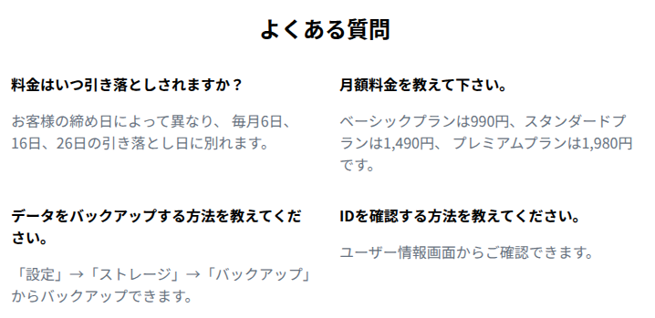

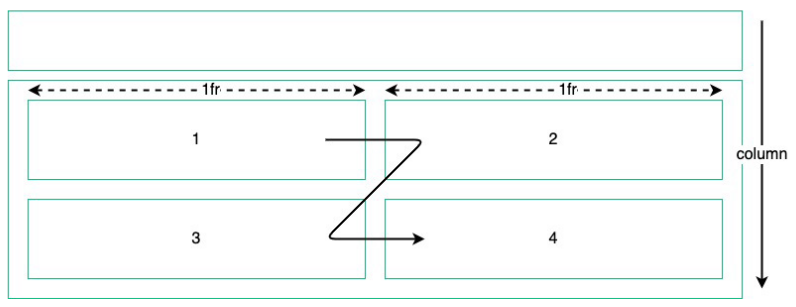

### 考え方

1. `display: flex` を使って、横並び(デフォルト配置)のレイアウトにする
2. `flex-direction: column` を使って、上下に配置
3. `grid` を使って、質問と回答セットをタイル状に配置
4. `grid-template-column: 1fr 1fr` を使って、2分割

```html
<!DOCTYPE html>
<html lang="ja">
  <head>
    <meta charset="UTF-8" />
    <meta
      name="viewport"
      content="width=device-width, initial-scale=1.0"
    />
    <title>レイアウト</title>
    <style>
      .questions {
        display: flex;
        flex-direction: column;
        gap: 32px;
        padding: 32px;
        color: #687280;
      }

      .questions .head h5 {
        margin: 0;
        color: #000000;
        text-align: center;
        font-size: 24px;
      }

      .questions .list {
        display: grid;
        grid-template-columns: 1fr 1fr;
        gap: 32px;
      }

      .questions .list .question p {
        margin: 0;
      }

      .questions .list .question .title {
        margin-bottom: 16px;
        color: #000000;
        font-weight: bold;
      }
    </style>
  </head>

  <body>
    <div class="questions">
      <div class="head">
        <h5>よくある質問</h5>
      </div>
      <div class="list">
        <div class="question">
          <p class="title">料金はいつ引き落としされますか？</p>
          <p>お客様の締め日によって異なり、 毎月6日、16日、26日の引き落とし日に別れます。</p>
        </div>
        <div class="question">
          <p class="title">月額料金を教えて下さい。</p>
          <p>
            ベーシックプランは990円、スタンダードプランは1,490円、 プレミアムプランは1,980円です。
          </p>
        </div>
        <div class="question">
          <p class="title">データをバックアップする方法を教えてください。</p>
          <p>「設定」→「ストレージ」→「バックアップ」からバックアップできます。</p>
        </div>
        <div class="question">
          <p class="title">IDを確認する方法を教えてください。</p>
          <p>ユーザー情報画面からご確認できます。</p>
        </div>
      </div>
    </div>
  </body>
</html>
```

## 問い合わせフォーム

- タイトルとフォームを上下に配置
- フォーム内のテキスト入力やボタンを2次元で配置
- 姓と名のテキスト入力は左右に配置
- メールアドレスは姓と名に渡る長さで1行に配置
- お問い合わせは姓と名に渡る長さで1行に配置

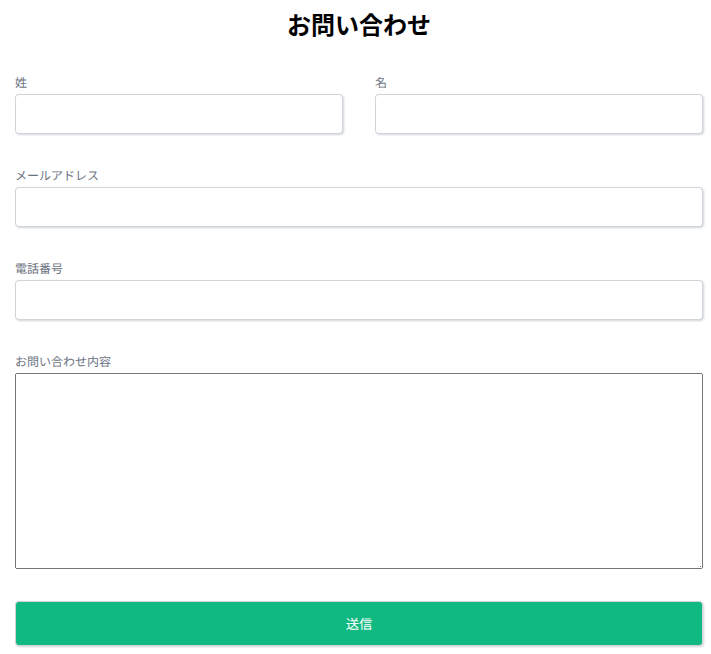

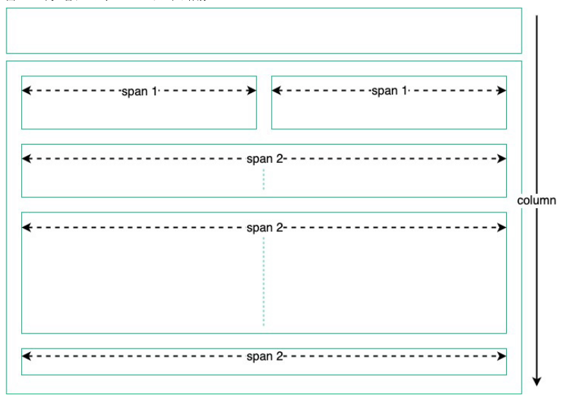

### 考え方

1. `display: flex` を使って、横並び(デフォルト配置)のレイアウトにする
2. `flex-direction: column` を明示して、タイトルと特徴を上下に配置
3. `grid` を使って下部分を2次元配置にする
4. `grit-template-column: 1fr 1fr` を使って2つに分割
5. 姓と名で2つの分割を利用

```html
<!DOCTYPE html>
<html lang="ja">
  <head>
    <meta charset="UTF-8" />
    <meta
      name="viewport"
      content="width=device-width, initial-scale=1.0"
    />
    <title>レイアウト</title>
    <style>
      .contact {
        display: flex;
        flex-direction: column;
        gap: 32px;
        padding: 32px;
        color: #6b7280;
      }

      .contact .head h1 {
        margin: 0;
        color: #000000;
        text-align: center;
        font-size: 24px;
      }

      .contact form {
        display: grid;
        grid-template-columns: 1fr 1fr;
        gap: 32px;
      }

      .contact form .row {
        display: flex;
        flex-direction: column;
        gap: 4px;
        grid-column-end: span 2;
      }

      .contact form .row.half {
        grid-column-end: span 1;
      }

      .contact form label {
        font-size: 12px;
      }

      .contact form input[type='text'],
      .contact from textarea {
        width: 100%;
        height: 40px;
        padding: 12px 12 px;
        border: solid 1px #d1d5db;
        border-radius: 4px;
        box-sizing: border-box;
        box-shadow: 1px 1px 2px #d1d5db;
      }

      .contact form input[type='submit'] {
        width: 100%;
        padding: 12px 12px;
        border: solid 1px #d1d5db;
        border-radius: 4px;
        box-sizing: border-box;
        box-shadow: 1px 1px 2px #d1d5db;
        background-color: #10b981;
        color: #ffffff;
        cursor: pointer;
      }

      .contact form input[type='submit']:hover {
        background-color: #047857;
      }
    </style>
  </head>

  <body>
    <div class="contact">
      <div class="head">
        <h1>お問い合わせ</h1>
      </div>
      <form>
        <div class="row half">
          <label>姓</label>
          <input
            type="text"
            name="last_name"
          />
        </div>
        <div class="row half">
          <label for="first_name">名</label>
          <input
            type="text"
            id="first_name"
            name="first_name"
          />
        </div>
        <div class="row">
          <label for="email">メールアドレス</label>
          <input
            type="text"
            id="email"
            name="email"
          />
        </div>
        <div class="row">
          <label for="phone_number">電話番号</label>
          <input
            type="text"
            id="phone_number"
            name="phone_number"
          />
        </div>
        <div class="row">
          <label for="message">お問い合わせ内容</label>
          <textarea
            id="message"
            name="message"
            rows="10"
          ></textarea>
        </div>
        <div class="row">
          <input
            type="submit"
            value="送信"
          />
        </div>
      </form>
    </div>
  </body>
</html>
```

## フッター

- リンク一覧/SNSリンク一覧/コピーライトを上下に配置

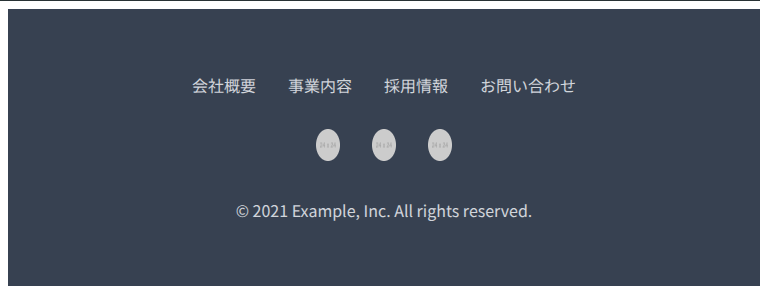

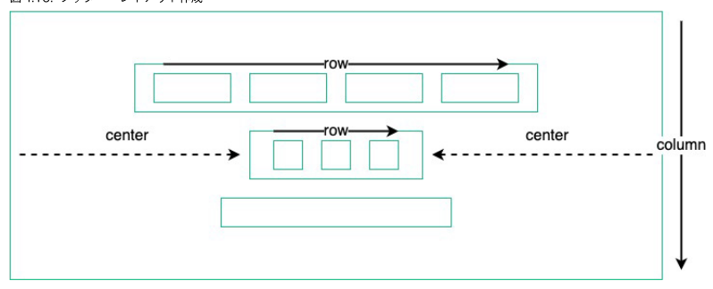

### 考え方

1. `display: flex` を使って、横並び(デフォルト配置)のレイアウトにする
2. `flex-direction: column` を使って上下に配置
3. `align-items: center` を使って、中央寄せ
4. `display: flex` を使って、各リンクを横並び(デフォルト配置)のレイアウトにする

```html
<!DOCTYPE html>
<html lang="ja">
  <head>
    <meta charset="UTF-8" />
    <meta
      name="viewport"
      content="width=device-width, initial-scale=1.0"
    />
    <title>レイアウト</title>
    <style>
      .footer {
        display: flex;
        flex-direction: column;
        align-items: center;
        gap: 32px;
        padding: 64px 32px;
        background-color: #374151;
      }

      .footer .links {
        display: flex;
        gap: 32px;
      }

      .footer .links a {
        color: #d1d5db;
        text-decoration: none;
      }

      .footer .links a:hover {
        color: #ffffff;
      }

      .footer .medias {
        display: flex;
        /* flex-direction: column; */
        gap: 32px;
      }

      .footer .medias img {
        border-radius: 50%;
      }

      .footer .copyright {
        margin: 0;
        color: #d1d5db;
      }
    </style>
  </head>

  <body>
    <footer class="footer">
      <div class="links">
        <a href="#">会社概要</a>
        <a href="#">事業内容</a>
        <a href="#">採用情報</a>
        <a href="#">お問い合わせ</a>
      </div>
      <div class="medias">
        <a href="#">
          
        </a>
        <a href="#">
          
        </a>
        <a href="#">
          
        </a>
      </div>
      <p class="copyright">© 2021 Example, Inc. All rights reserved.</p>
    </footer>
  </body>
</html>
```

## モーダル

- タイトル/メッセージ/ボタンを上下に配置

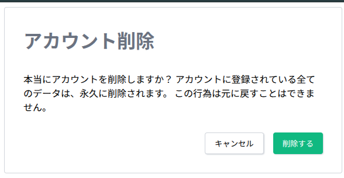


### 考え方

1. `display: flex` を2度使いモーダル自身とその小要素に指定
2. `flex-direction: column` を使って、タイトルと特徴を上下に配置
3. `justify-contact: center` を使って、モーダル自身を中央に配置
4. `align-items: center` を使って、モーダル内のアイテムを中央に配置
5. `.actions` クラスで `display: flex` を使って、左右配置にする
6. `justify-content: flex-end` を使って、2つのボタンを右(end方向)に配置

```html
<!DOCTYPE html>
<html lang="ja">
  <head>
    <meta charset="UTF-8" />
    <meta
      name="viewport"
      content="width=device-width, initial-scale=1.0"
    />
    <title>レイアウト</title>
    <style>
      .modal-container {
        display: flex;
        flex-direction: column;
        justify-content: center;
        align-items: center;
        width: 100vw;
        height: 100vh;
        background-color: #6b7280;
      }

      .modal {
        display: flex;
        flex-direction: column;
        gap: 16px;
        width: 512px;
        padding: 32px;
        background-color: #ffffff;
        border: solid 1px #d1d5db;
        border-radius: 4px;
      }

      .modal .title h1 {
        margin: 0;
        color: #6b7280;
      }

      .modal .actions {
        display: flex;
        justify-content: flex-end;
        gap: 16px;
      }

      .modal .actions .button {
        padding: 8px 16px;
        border: none;
        border-radius: 4px;
        box-shadow: 1px 1px 2px #d1d5db;
        cursor: pointer;
      }

      .modal .actions .button.primary {
        background-color: #10b981;
        color: #ffffff;
      }

      .modal .actions .button.button.primary:hover {
        background-color: #047857;
      }

      .modal .actions .button.outlined {
        border: 1px solid #d1d5db;
        background-color: #ffffff;
        color: #000000;
      }

      .modal .actions .button.outlined:hover {
        background-color: #d1d5db;
      }
    </style>
  </head>

  <body>
    <div class="modal-container">
      <div class="modal">
        <div class="title">
          <h1>アカウント削除</h1>
        </div>
        <div class="body">
          <p>
            本当にアカウントを削除しますか？
            アカウントに登録されている全てのデータは、永久に削除されます。
            この行為は元に戻すことはできません。
          </p>
        </div>
        <div class="actions">
          <button class="button outlined">キャンセル</button>
          <button class="button primary">削除する</button>
        </div>
      </div>
    </div>
  </body>
</html>
```

## 通知メッセージ

- 通知メッセージ一覧を上下に配置
- 各通知メッセージのアイコン/テキスト/ボタンを左右に配置

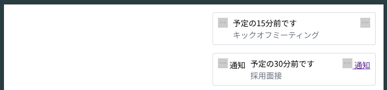

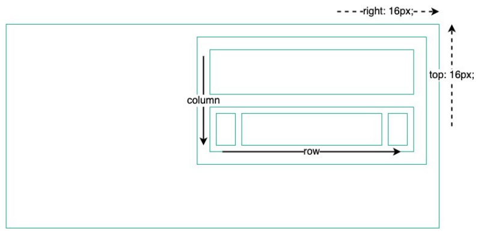

### 考え方

1. `display: flex` を使って、横並び(デフォルト配置)のレイアウトにする
2. `flex-direction: column` を使って、上下に配置
3. `position: fixed` を使って位置を固定(`top; 16px; right: 16px`)
4. `display: flex` を `.message ` クラスで使って左右に配置
5. 4. `display: flex` を `.body ` クラスでメッセージ内容を上下にに配置

```html
<!DOCTYPE html>
<html lang="ja">
  <head>
    <meta charset="UTF-8" />
    <meta
      name="viewport"
      content="width=device-width, initial-scale=1.0"
    />
    <title>レイアウト</title>
    <style>
      .notifications {
        display: flex;
        flex-direction: column;
        gap: 16px;
        position: fixed;
        top: 16px;
        right: 16px;
      }

      .message {
        display: flex;
        align-items: flex-start;
        gap: 8px;
        width: 312px;
        padding: 8px;
        background-color: #ffffff;
        border: 1px solid #d1d5db;
        border-radius: 4px;
      }

      .message .icon {
        padding: 2px;
      }

      .message .body {
        flex: 1;
        display: flex;
        flex-direction: column;
      }

      .message .body p {
        margin: 0;
        color: #6b7280;
      }

      .message .body .title {
        color: #000000;
      }

      .message .close {
        padding: 2px;
      }
    </style>
  </head>

  <body>
    <div class="notifications">
      <div class="message">
        <div class="icon">
          
        </div>
        <div class="body">
          <p class="title">予定の15分前です</p>
          <p>キックオフミーティング</p>
        </div>
        <div class="close">
          <a href="#">
            
          </a>
        </div>
      </div>
      <div class="message">
        <div class="icon">
          <a href="#">
            
          </a>
        </div>
        <div class="body">
          <p class="title">予定の30分前です</p>
          <p>採用面接</p>
        </div>
        <div class="close">
          
        </div>
      </div>
    </div>
  </body>
</html>
```
